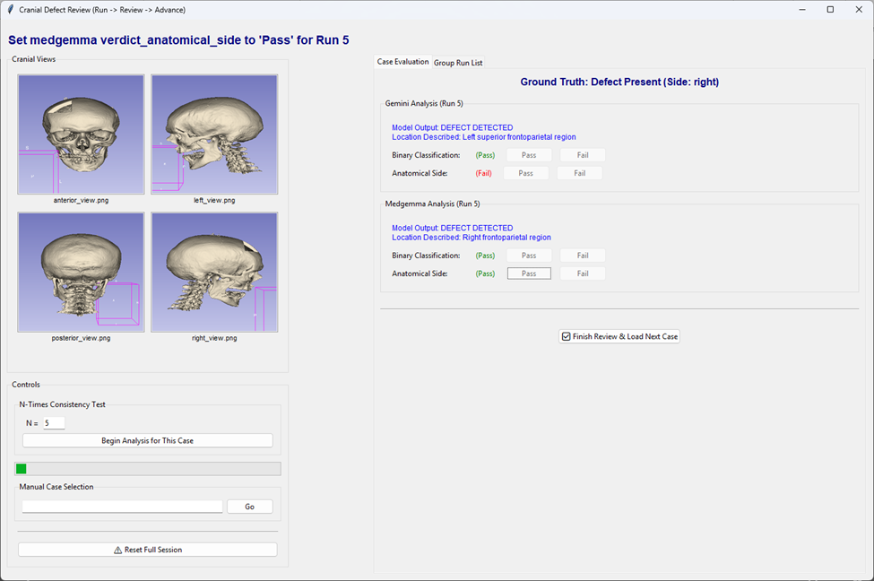

Case triaging and CT report writing require precise anatomic information to be useful in clinical practice. The main idea of the workflow proposed here is to improve spatial reasoning of the analysis VLMs by providing them with directional information embedded into screenshots via the filenames. Four screenshots are taken from their respective anatomic directions (anterior, posterior, left, right) and each is analyzed by telling the analysis VLMs in their prompt to only analyze the view being looked at. The analysis in each perspective is then combined into the Overall Assessment. We can take advantage of a DICOM data attribute which is storage of orientation information in the metadata so I can extract it reliably through 3D Slicer when taking screenshots. The screenshots are captured using Claude Sonnet 4 inside Claude desktop which is connected to 3D Slicer using MCP. 

This scaffold allows models to convert each image’s data into text then piece together each view to reason about the properties of the 3D model. Increased reliability in defect side recognition could add significant value in a clinical context. Additionally, a workflow built in 3D slicer makes it easy to keep a human in the loop by making the process more interpretable by using the same type of software that clinical users are accustomed to. This procedure can be looped to call for additional views as needed.

Fine-tuning was not used for this iteration but this could improve the consistency of the outputs when fewer samples are taken. 

The scaffolding workflow improves Gemini Flash's anatomic side classification from 20% (zeroshot) to 93% (majority vote) while maintaining similar performance on defect detection tasks. MedGemma showed comparatively minor improvements and appeared more resistant to the scaffolding approach.

In total, 20 scans were used where 16 had defects and 4 were healthy. I tested Gemini 2.5 Flash Preview 05-20 and MedGemma 4b with best-of-N sampling to 5 attempts per case and then manually evaluated the text outputs for both with and without the multi-image prompt workflow using a UI I made as shown below.

  

Below is the first plot which shows the accuracy of the models when tasked with identifying the side of the defect. Specifically, this shows the occurrence of a correct answer to the right/left side defect question at one try or within 5 tries. 

 
This is a significant boost that likely comes from the fact that we can directly tell the model what side it is looking at (through the image capturing process) but does seem to overcome the challenge of having the model try to understand on its own if we are interested in the anatomic versus screen direction without any specialized training adjustments. Gemini Flash received the most benefit but MedGemma's improvements were also noticeable.

The next thing I looked at was how consistent these results were over the 5 guesses. When considering this I took a majority vote approach where if 3 or more guesses were the same then they are treated as the final answer.

 
Gemini Flash becomes significantly more reliable and given its low cost to run getting to 93.3% with its 5 attempts is valuable. MedGemma in general seems to be less affected by the scaffolding approach in both plots so far which I'm assuming is related to the fact that I am using the 4b version.
 
I also looked at the task of defect classification (is a defect present yes/no). These metrics were a bit less clear because it's not always obvious exactly what is being referred to as a defect from the model's text output so there is false positive risk. For example, we cannot tell from text alone if the defect being called out is the normal anatomy like the ear canal or thin bone which did not render from thresholding.

 
The results were consistent with and without scaffolding with a decrease in performance for Gemini Flash with scaffolding. 

MedGemma also struggled with true negatives. For all 4 cases where no defect was present, both with and without scaffolding, MedGemma would prescribe a defect to be present. Gemini Flash displayed better reliably when calling out these images for no defect being present.

Lastly the plot below is based on majority vote for the models getting both the defect present being correct and for the defect side being correct.

 
Gemini Flash ends up being the clear winner here when both tasks are passed to it for analysis.

One thing I have noticed in my own experience of trying to test out VLMs is that potential end users can be really put off by models getting "the easy things" wrong. Being able to consistently get the correct anatomic side and presence of obvious defects fall into that category of something that a new engineer or care provider could quickly pick up on. A scaffold like the one I described can help increase adoption of models by improving the accuracy of these types of tasks at the prompt level
